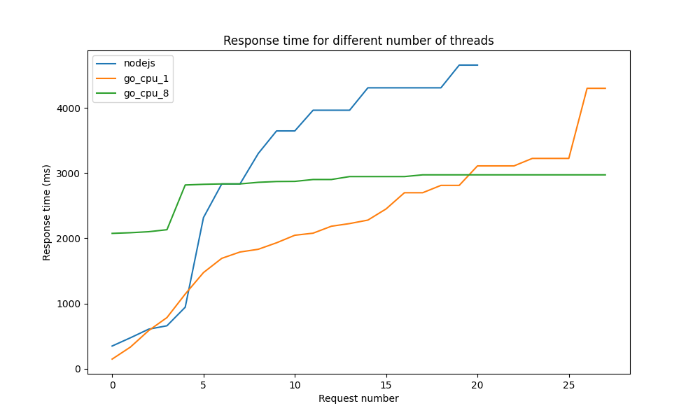

# Big Small

## Graph of the results



### Node.js

```
Running 5s test @ http://localhost:3000/big
  2 threads and 10 connections
  Thread Stats   Avg      Stdev     Max   +/- Stdev
    Latency     2.22s     1.57s    4.65s    53.85%
    Req/Sec       -nan      -nan   0.00      0.00%
  Latency Distribution (HdrHistogram - Recorded Latency)
 50.000%    2.32s 
 75.000%    3.65s 
 90.000%    4.31s 
 99.000%    4.66s 
 99.900%    4.66s 
 99.990%    4.66s 
 99.999%    4.66s 
100.000%    4.66s 

  Detailed Percentile spectrum:
       Value   Percentile   TotalCount 1/(1-Percentile)

     347.647     0.000000            1         1.00
     474.111     0.100000            2         1.11
     606.207     0.200000            3         1.25
     658.431     0.300000            4         1.43
     943.103     0.400000            6         1.67
    2318.335     0.500000            7         2.00
    2834.431     0.550000            8         2.22
    2834.431     0.600000            8         2.50
    3301.375     0.650000            9         2.86
    3647.487     0.700000           10         3.33
    3647.487     0.750000           10         4.00
    3964.927     0.775000           11         4.44
    3964.927     0.800000           11         5.00
    3964.927     0.825000           11         5.71
    4308.991     0.850000           12         6.67
    4308.991     0.875000           12         8.00
    4308.991     0.887500           12         8.89
    4308.991     0.900000           12        10.00
    4308.991     0.912500           12        11.43
    4657.151     0.925000           13        13.33
    4657.151     1.000000           13          inf
#[Mean    =     2219.146, StdDeviation   =     1573.077]
#[Max     =     4653.056, Total count    =           13]
#[Buckets =           27, SubBuckets     =         2048]
----------------------------------------------------------
  15 requests in 5.75s, 2.05KB read
  Socket errors: connect 0, read 0, write 0, timeout 13
Requests/sec:      2.61
Transfer/sec:     365.02B
```

### Go CUP 1

```
unning 5s test @ http://localhost:8090/big
  2 threads and 10 connections
  Thread Stats   Avg      Stdev     Max   +/- Stdev
    Latency     1.48s   939.58ms   4.30s    66.67%
    Req/Sec       -nan      -nan   0.00      0.00%
  Latency Distribution (HdrHistogram - Recorded Latency)
 50.000%    1.47s 
 75.000%    2.05s 
 90.000%    2.70s 
 99.000%    4.30s 
 99.900%    4.30s 
 99.990%    4.30s 
 99.999%    4.30s 
100.000%    4.30s 

  Detailed Percentile spectrum:
       Value   Percentile   TotalCount 1/(1-Percentile)

     147.071     0.000000            1         1.00
     331.775     0.100000            5         1.11
     584.703     0.200000            9         1.25
     784.383     0.300000           13         1.43
    1144.831     0.400000           17         1.67
    1474.559     0.500000           21         2.00
    1692.671     0.550000           24         2.22
    1789.951     0.600000           26         2.50
    1831.935     0.650000           28         2.86
    1931.263     0.700000           30         3.33
    2046.975     0.750000           32         4.00
    2078.719     0.775000           33         4.44
    2185.215     0.800000           34         5.00
    2226.175     0.825000           35         5.71
    2279.423     0.850000           36         6.67
    2451.455     0.875000           37         8.00
    2699.263     0.887500           38         8.89
    2699.263     0.900000           38        10.00
    2811.903     0.912500           39        11.43
    2811.903     0.925000           39        13.33
    3110.911     0.937500           40        16.00
    3110.911     0.943750           40        17.78
    3110.911     0.950000           40        20.00
    3225.599     0.956250           41        22.86
    3225.599     0.962500           41        26.67
    3225.599     0.968750           41        32.00
    3225.599     0.971875           41        35.56
    3225.599     0.975000           41        40.00
    4300.799     0.978125           42        45.71
    4300.799     1.000000           42          inf
#[Mean    =     1478.808, StdDeviation   =      939.583]
#[Max     =     4296.704, Total count    =           42]
#[Buckets =           27, SubBuckets     =         2048]
----------------------------------------------------------
  44 requests in 5.52s, 5.80KB read
  Socket errors: connect 0, read 0, write 0, timeout 2
Requests/sec:      7.97
Transfer/sec:      1.05KB
```

### Go CUP 8

```
Running 5s test @ http://localhost:8090/big
  2 threads and 10 connections
  Thread Stats   Avg      Stdev     Max   +/- Stdev
    Latency     2.07s   652.13ms   2.97s    33.33%
    Req/Sec       -nan      -nan   0.00      0.00%
  Latency Distribution (HdrHistogram - Recorded Latency)
 50.000%    2.08s 
 75.000%    2.83s 
 90.000%    2.87s 
 99.000%    2.97s 
 99.900%    2.97s 
 99.990%    2.97s 
 99.999%    2.97s 
100.000%    2.97s 

  Detailed Percentile spectrum:
       Value   Percentile   TotalCount 1/(1-Percentile)

    1233.919     0.000000            1         1.00
    1261.567     0.100000            3         1.11
    1283.071     0.200000            6         1.25
    1302.527     0.300000            9         1.43
    2009.087     0.400000           12         1.67
    2075.647     0.500000           16         2.00
    2085.887     0.550000           17         2.22
    2101.247     0.600000           18         2.50
    2131.967     0.650000           20         2.86
    2818.047     0.700000           21         3.33
    2828.287     0.750000           23         4.00
    2834.431     0.775000           24         4.44
    2834.431     0.800000           24         5.00
    2859.007     0.825000           25         5.71
    2871.295     0.850000           26         6.67
    2873.343     0.875000           27         8.00
    2873.343     0.887500           27         8.89
    2873.343     0.900000           27        10.00
    2902.015     0.912500           28        11.43
    2902.015     0.925000           28        13.33
    2947.071     0.937500           29        16.00
    2947.071     0.943750           29        17.78
    2947.071     0.950000           29        20.00
    2947.071     0.956250           29        22.86
    2947.071     0.962500           29        26.67
    2973.695     0.968750           30        32.00
    2973.695     1.000000           30          inf
#[Mean    =     2072.218, StdDeviation   =      652.130]
#[Max     =     2971.648, Total count    =           30]
#[Buckets =           27, SubBuckets     =         2048]
----------------------------------------------------------
  32 requests in 5.13s, 4.22KB read
Requests/sec:      6.24
Transfer/sec:     842.55B
```