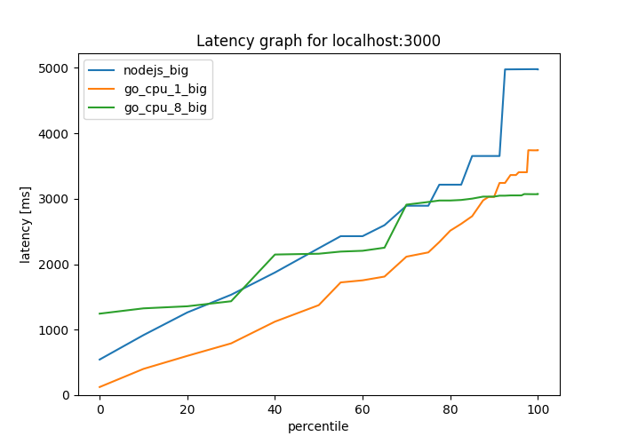

# Big Small

## Graph of the results

### Small


### Big


## Small and Big


### Node.js

```shell
wrk --rate=20 --duration=5s "http://localhost:3000/small" --latency > nodejs_small  
wrk --rate=20 --duration=5s "http://localhost:3000/big" --latency > nodejs_big

```

### Go CPU 1

```shell
wrk --rate=20 --duration=5s "http://localhost:3000/small" --latency > go_cpu_1_small
wrk --rate=20 --duration=5s "http://localhost:3000/big" --latency > go_cpu_1_big
```

### Go CPU 8

```
wrk --rate=20 --duration=5s "http://localhost:3000/small" --latency > go_cpu_8_small
wrk --rate=20 --duration=5s "http://localhost:3000/big" --latency > go_cpu_8_big
```

## Graph

```shell
cat nodejs_small go_cpu_1_small go_cpu_8_small | wrk2img --name nodejs_small,go_cpu_1_small,go_cpu_8_small graph-sm.png 
```

```shell
cat nodejs_big go_cpu_1_big go_cpu_8_big | wrk2img --name nodejs_big,go_cpu_1_big,go_cpu_8_big graph-bm.png  
```

```shell
cat nodejs_small nodejs_big go_cpu_1_big go_cpu_1_small go_cpu_8_small go_cpu_8_big | wrk2img --name nodejs_small,nodejs_big,go_cpu_1_big,go_cpu_1_samll,go_cpu_8_small,go_cpu_8_big output-x.png
```

## Python Package

https://github.com/PPACI/wrk2img
